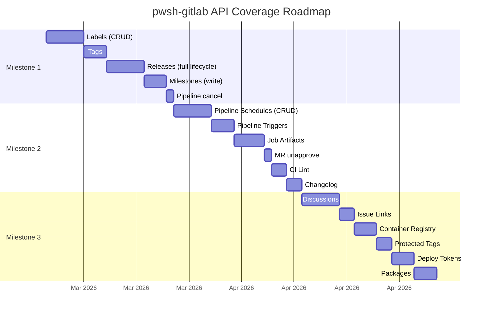

# Planning

## Gap Analysis Dimensions

### 1. GitLab REST API Coverage

The primary measure of completeness — how much of the ~144 [GitLab REST API](https://docs.gitlab.com/ee/api/rest/) resource areas does pwsh-gitlab cover?

**Current coverage: ~25 resource areas (~110 endpoints)**

#### Coverage by Category

**Full or Strong Coverage** — these areas have mature, multi-operation support:

| API Resource | pwsh-gitlab Coverage | Notes |
|---|---|---|
| Projects | Full CRUD + fork, archive, transfer, share, delete | 15+ cmdlets |
| Groups | Full CRUD + subgroups, descendants, transfer, share | 10+ cmdlets |
| Merge Requests | List, create, merge, approve + approval rules/config | Global, project, group scopes |
| Issues | List, create + notes | Global, project, group scopes |
| Pipelines | List, get, delete, variables, test report | |
| Jobs | List, get, trace | Project + pipeline scopes |
| Branches | List, get, create, protect, unprotect | |
| Protected Branches | List, get, create, delete | |
| Commits | List, get | |
| Repository Files | Get, create, update + tree | |
| Repository Tree | List | |
| Runners | List, get, update, delete + jobs | |
| Members | Full CRUD at project + group level | |
| Variables | Full CRUD at project + group level | |
| Access Tokens | List, create, delete at project + group level | |
| Personal Access Tokens | List, get, get self | |
| Project Hooks | Full CRUD | |
| Integrations | Get, update, delete | |
| Environments | List, get, stop | |
| Deployments | List, get | |
| Snippets | Full CRUD + raw content | Personal snippets |
| Topics | Full CRUD | |
| Milestones | Read-only (project + group) | |
| Releases | Read-only | |
| Audit Events | List, get at instance/group/project | |
| Todos | List, mark done, mark all done | |
| Search | Global, group, project scopes | |
| Users | List, get, get current, events | |
| Events | Project + user events | |
| Version / Metadata | Get | |
| GraphQL | Direct query support | Not a REST resource, but notable |

#### Gap Analysis — Missing API Resources

Categorized by relevance to pwsh-gitlab's identity as an **API-first automation tool**.

**High Value — Common automation workflows:**

| # | API Resource | Key Operations | Why It Matters |
|---|---|---|---|
| 1 | **Labels** (project + group) | List, get, create, update, delete, subscribe | Used on every issue/MR. Table stakes. |
| 2 | **Releases** (write) | Create, update, delete + asset links | Release automation is core CI/CD. Already have read-only. |
| 3 | **Milestones** (write) | Create, update, delete, list issues/MRs | Already have read-only. Small lift to complete. |
| 4 | **Tags** | List, get, create, delete | Closely related to releases. No coverage today. |
| 5 | **Pipeline Schedules** (CRUD) | List, get, create, update, delete + variables | Only have take_ownership today. |
| 6 | **Pipeline Triggers** | List, get, create, update, delete, trigger | No coverage. Common CI/CD automation. |
| 7 | **Job Artifacts** | Download, list files, keep, delete | No coverage. Frequent automation need. |
| 8 | **Issue Links** | List, create, delete | No coverage. Useful for cross-referencing. |
| 9 | **Discussions** (threaded comments) | List, create, resolve on MRs/issues | Only have flat notes today. |
| 10 | **MR Approvals** (unapprove) | Unapprove / revoke | Already have approve. Missing the inverse. |

**Medium Value — Useful for specific workflows:**

| # | API Resource | Key Operations | Why It Matters |
|---|---|---|---|
| 11 | **Container Registry** | List repos, list/delete tags | Relevant for CI/CD image management. |
| 12 | **Packages** (generic) | List, get, delete (project + group) | Package management visibility. |
| 13 | **Wikis** (project + group) | List, get, create, update, delete | Documentation automation. |
| 14 | **Deploy Tokens** | List, create, delete (project + group) | CI/CD credential management. |
| 15 | **Deploy Keys** | Full CRUD | Currently no coverage despite glab having it. |
| 16 | **Protected Tags** | List, get, create, delete | Complement to protected branches. |
| 17 | **Protected Environments** | List, get, create, update, delete | Deployment safety controls. |
| 18 | **Freeze Periods** | CRUD | Deployment freeze management. |
| 19 | **Merge Trains** | List, get status, add to train | GitLab CI merge queue support. |
| 20 | **Remote Mirrors** | CRUD + force sync | Repository mirroring. |
| 21 | **Changelog** | Get/create from repo API | Release notes generation. |
| 22 | **CI Lint** | Validate .gitlab-ci.yml | Useful for CI/CD development. |
| 23 | **Badges** (project + group) | CRUD | Project/group branding. |
| 24 | **Invitations** | CRUD (project + group) | Access management automation. |
| 25 | **Notification Settings** | Get, update | Preference management. |
| 26 | **Project Import/Export** | Export, download, import | Migration automation. |
| 27 | **Suggestions** (code suggestions in MRs) | Apply, batch apply | Code review automation. |

**Low Value — Niche or admin-only:**

| # | API Resource | Notes |
|---|---|---|
| 28 | Broadcast Messages | Admin-only |
| 29 | Application Settings | Admin-only |
| 30 | License | Admin-only |
| 31 | Sidekiq Metrics | Admin-only |
| 32 | System Hooks | Admin-only |
| 33 | Feature Flags (admin) | Admin-only |
| 34 | Plan Limits | Admin-only |
| 35 | Appearance | Admin-only |
| 36 | Vulnerabilities / Findings | Security-specific |
| 37 | Dependencies | Security-specific |
| 38 | Error Tracking | Niche |
| 39 | Geo Nodes/Sites | Enterprise/HA-specific |
| 40 | Cluster Agents (K8s) | Infrastructure-specific |
| 41 | Custom Attributes | Niche |
| 42 | Namespaces | Low-level; usually access groups/projects directly |
| 43 | Resource Label Events | Audit/history |
| 44 | External Status Checks | Niche |
| 45 | Feature Flags (project) | Niche |
| 46 | Draft Notes (MR) | Niche |
| 47 | Emoji Reactions | Niche |
| 48 | Epics (deprecated) | Being replaced by Work Items |
| 49 | Member Roles | Premium/custom roles |
| 50 | Repository Submodules | Niche |
| 51 | Model Registry | ML-specific |
| 52 | Markdown render | Niche |

**Out of Scope — Package manager protocol endpoints:**

Composer, Conan, Debian, Go Proxy, Helm, Maven, npm, NuGet, PyPI, RubyGems, Terraform Modules — these are package-manager protocol implementations, not management APIs.

### 2. glab CLI Parity

A secondary measure — where does [glab](https://gitlab.com/gitlab-org/cli) have capabilities that pwsh-gitlab lacks?

pwsh-gitlab is **broader and deeper than glab** in most API-management areas (groups, approvals, tokens, webhooks, integrations, audit, admin). glab excels in developer-workflow UX (checkout, rebase, interactive views, stacked diffs).

## Prioritized Backlog

### Tier 1 — High Impact, Common Workflows

| # | Feature | Scope | Rationale |
|---|---------|-------|-----------|
| 1 | **Labels (CRUD)** | `Get-GitlabLabel`, `New-GitlabLabel`, `Update-GitlabLabel`, `Remove-GitlabLabel` — project + group scope | Labels are everywhere — issues, MRs, boards. Table-stakes API. |
| 2 | **Releases (full lifecycle)** | `New-GitlabRelease`, `Update-GitlabRelease`, `Remove-GitlabRelease` + asset links | Current `Get-GitlabRelease` is read-only. Release automation is a core CI/CD workflow. |
| 3 | **Milestones (write)** | `New-GitlabMilestone`, `Update-GitlabMilestone`, `Remove-GitlabMilestone` — project + group | Already have `Get-GitlabMilestone`. Completing the CRUD is small incremental work. |
| 4 | **Tags** | `Get-GitlabTag`, `New-GitlabTag`, `Remove-GitlabTag` | No coverage today. Closely related to releases. |
| 5 | **Pipeline Schedules (full CRUD)** | `Get-GitlabPipelineSchedule`, `New-GitlabPipelineSchedule`, `Update-GitlabPipelineSchedule`, `Remove-GitlabPipelineSchedule` + variables | Only have take-ownership today. Core CI/CD automation. |
| 6 | **Pipeline Triggers** | `Get-GitlabPipelineTrigger`, `New-GitlabPipelineTrigger`, `Remove-GitlabPipelineTrigger` | Cross-project pipeline triggering. |
| 7 | **Job Artifacts** | `Get-GitlabJobArtifact`, `Save-GitlabJobArtifact`, `Remove-GitlabJobArtifact` | Download/manage build artifacts. Frequent need. |
| 8 | **Pipeline cancel** | `Stop-GitlabPipeline` | Small gap to close. |

### Tier 2 — Medium Impact, Developer Workflow

| # | Feature | Scope | Rationale |
|---|---------|-------|-----------|
| 9 | **MR unapprove** | `Revoke-GitlabMergeRequestApproval` | Already have `Approve-GitlabMergeRequest`. Natural complement. |
| 10 | **Discussions** | Threaded comment support on MRs/issues | Currently only flat notes. Discussions are the richer model. |
| 11 | **Issue Links** | `Get-GitlabIssueLink`, `New-GitlabIssueLink`, `Remove-GitlabIssueLink` | Cross-referencing issues. |
| 12 | **CI Lint** | `Test-GitlabCiConfig` | Validate .gitlab-ci.yml without pushing. |
| 13 | **Changelog** | `New-GitlabChangelog` | GitLab's changelog API generates notes from MR metadata. |
| 14 | **Container Registry** | `Get-GitlabContainerRegistry`, `Remove-GitlabContainerRegistryTag` | Image management in CI/CD. |
| 15 | **Packages** | `Get-GitlabPackage`, `Remove-GitlabPackage` | Package visibility and cleanup. |
| 16 | **Deploy Tokens** | CRUD at project + group level | CI/CD credential management. |
| 17 | **Protected Tags** | `Protect-GitlabTag`, `UnProtect-GitlabTag` | Complement to protected branches. |
| 18 | **Wikis** | CRUD for project + group wikis | Documentation automation. |
| 19 | **SSH key management (write)** | `New-GitlabKey`, `Remove-GitlabKey` | Already have `Get-GitlabKey`. Completing CRUD is small. |

### Tier 3 — Low Impact / Niche

| # | Feature | Scope | Rationale |
|---|---------|-------|-----------|
| 20 | **Protected Environments** | CRUD | Deployment safety controls. |
| 21 | **Freeze Periods** | CRUD | Deployment freeze management. |
| 22 | **Merge Trains** | List, get status | Merge queue visibility. |
| 23 | **Badges** | CRUD (project + group) | Branding/status badges. |
| 24 | **Remote Mirrors** | CRUD + force sync | Repository mirroring. |
| 25 | **Project Import/Export** | Export, download, import | Migration automation. |
| 26 | **Invitations** | CRUD (project + group) | Access management. |
| 27 | **GPG keys** | CRUD | One-time setup. Low frequency. |
| 28 | **Iterations** | Read-only | Agile-shop feature. |
| 29 | **Secure files** | CRUD | CI/CD secure file management. |

### Won't Do (or defer indefinitely)

| Feature | Reason |
|---|---|
| **Package manager protocols** (npm, NuGet, etc.) | Protocol endpoints, not management APIs |
| **Stacked diffs** (`glab stack`) | Heavy git-workflow UX; better served by glab itself |
| **MR checkout / rebase** | Git operations, not API — users already have git |
| **Duo AI / Code Suggestions** | Proprietary GitLab feature |
| **Epics** | Deprecated, being replaced by Work Items |
| **Kubernetes agents / Clusters** | Infrastructure-specific |
| **Vulnerabilities / Security** | Security-scanner-specific |
| **Admin-only settings** | Application settings, broadcast messages, Sidekiq, etc. |
| **Work Items** | Still early/evolving in GitLab |

## Milestone Plan

### Milestone 1 — Core CRUD Gaps

**Theme:** Close the most visible holes in everyday project management APIs.

| Feature | Scope | Items |
|---------|-------|-------|
| Labels (CRUD) | Project + group; list, get, create, update, delete | 4-5 cmdlets |
| Tags | List, get, create, delete | 3 cmdlets |
| Releases (full lifecycle) | Create, update, delete + asset links | 3-4 cmdlets |
| Milestones (write) | Create, update, delete — project + group | 3 cmdlets |
| Pipeline cancel | `Stop-GitlabPipeline` | 1 cmdlet |

**Outcome:** pwsh-gitlab has complete CRUD for the resources users interact with most — labels, releases, tags, milestones. Coverage moves from ~25 to ~30 resource areas.

### Milestone 2 — CI/CD Automation

**Theme:** Fill the CI/CD pipeline management gaps so pwsh-gitlab can fully automate build workflows.

| Feature | Scope | Items |
|---------|-------|-------|
| Pipeline Schedules (full CRUD) | List, get, create, update, delete + schedule variables | 5-6 cmdlets |
| Pipeline Triggers | List, get, create, update, delete, trigger pipeline | 4-5 cmdlets |
| Job Artifacts | Download archive, list files, keep, delete | 3-4 cmdlets |
| MR unapprove | Revoke approval | 1 cmdlet |
| CI Lint | Validate .gitlab-ci.yml | 1 cmdlet |
| Changelog | Generate from repository API | 1 cmdlet |

**Outcome:** Full pipeline lifecycle management — schedules, triggers, artifacts, and validation. Coverage moves to ~35 resource areas.

### Milestone 3 — Developer Workflow Breadth

**Theme:** Round out the developer experience with collaboration and registry features.

| Feature | Scope | Items |
|---------|-------|-------|
| Discussions | Threaded comments on MRs/issues; create, resolve | 3-4 cmdlets |
| Issue Links | List, create, delete | 3 cmdlets |
| Container Registry | List repos, list/delete tags | 2-3 cmdlets |
| Protected Tags | List, get, create, delete | 3 cmdlets |
| Deploy Tokens | CRUD at project + group level | 4-5 cmdlets |
| Packages | List, get, delete (project + group) | 2-3 cmdlets |

**Outcome:** Comprehensive developer workflow coverage. Coverage moves to ~40+ resource areas. Remaining gaps are niche/admin (Tier 3 and Won't Do).

## Next Up

Tracking work inline rather than in [GitHub Issues](https://github.com/chris-peterson/pwsh-gitlab/issues) — easier to keep priorities visible as we work through highest-value items.

- [ ] **Labels (CRUD)** — `Get-GitlabLabel`, `New-GitlabLabel`, `Update-GitlabLabel`, `Remove-GitlabLabel` at project + group scope
- [ ] **Tags** — `Get-GitlabTag`, `New-GitlabTag`, `Remove-GitlabTag`
- [ ] **Releases (write)** — `New-GitlabRelease`, `Update-GitlabRelease`, `Remove-GitlabRelease` + asset links
