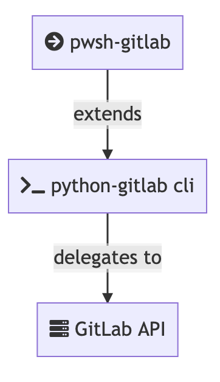

# Overview

Interact with [GitLab](https://about.gitlab.com/) via [PowerShell](https://github.com/powershell/powershell#-powershell)

## Status

[](https://www.powershellgallery.com/packages/GitlabCli)
[](https://www.powershellgallery.com/packages/GitlabCli)
[](LICENSE)
[](https://github.com/chris-peterson/pwsh-gitlab/actions/workflows/deploy.yml)

## Tech Stack



## Getting Started

```powershell
Install-Module -Name GitlabCli
```

### Configuration

#### `$env:GITLAB_ACCESS_TOKEN`

Obtain a "Personal Access Token" (PAT) for your GitLab instance

`https://<your gitlab instance>/-/profile/personal_access_tokens`


Make the value available via

`$env:GITLAB_ACCESS_TOKEN='<your pat>'`.

One way to do this would be to add a line to your `$PROFILE`

#### `$env:GITLAB_URL`

(Optional) If using a gitlab instance that is not `gitlab.com`, provide it via:

`$env:GITLAB_URL='<your gitlab instance>'`

### Example PowerShell Profile

```powershell
$env:GITLAB_URL='gitlab.mydomain.com'
$env:GITLAB_ACCESS_TOKEN='<my token>'
Import-Module GitlabCli
```
## Global Switches

`-WhatIf` : For mutable operations (or for some complex query operations), gives a preview of what actions would be taken.

`-Follow` : For operations that create a resource, follow the the URL after creation

## Global Behaviors

If invoking commands from within a git repository, `.` can be used for `ProjectId` / `BranchName` to use the local context.

## Examples

### Groups

#### `Get-GitlabGroup`

```powershell
Get-GitlabGroup 'mygroup'
```

```plaintext
  ID Name     Url
  -- ----     ---
  23 mygroup  https://gitlab.mydomain.com/mygroup
```

#### `Remove-GitlabGroup`

```powershell
Remove-GitlabGroup 'mygroup'
```

#### `Clone-GitlabGroup` (aka `Copy-GitlabGroupToLocalFileSystem`)

```powershell
Clone-GitlabGroup 'mygroup'
```

### Projects

#### `Get-GitlabProject` (by id)

```powershell
Get-GitlabProject 'mygroup/myproject'
# OR
Get-GitlabProject 42
# OR
Get-GitlabProject . # use local context
```

```plaintext
  ID Name        Group     Url
  -- ----        -----     ---
  42 myproject   mygroup   https://gitlab.mydomain.com/mygroup/myproject
```

#### `Get-GitlabProject` (by group)

```powershell
Get-GitlabProject -GroupId 'mygroup/subgroup'
```

```plaintext
  ID Name        Group             Url
  -- ----        -----             ---
   1 database    mygroup/subgroup  https://gitlab.mydomain.com/mygroup/subgroup/database
   2 infra       mygroup/subgroup  https://gitlab.mydomain.com/mygroup/subgroup/infra
   3 service     mygroup/subgroup  https://gitlab.mydomain.com/mygroup/subgroup/service
   4 website     mygroup/subgroup  https://gitlab.mydomain.com/mygroup/subgroup/website
```

_Optional Parameters_

`-IncludeArchived` - Set this switch to include archived projects.  _By default, archived projects are not returned_

#### `Transfer-GitlabProject` (aka `Move-GitlabProject`)

```powershell
Transfer-GitlabProject -ProjectId 'this-project' -DestinationGroup 'that-group'
```

### Merge Requests

#### `New-GitlabMergeRequest`

```powershell
New-GitlabMergeRequest
```

_Optional Parameters_

`-ProjectId` - Defaults to local git context

`-SourceBranch` - Defaults to local git context

`-TargetBranch` - Defaults to the default branch set in repository config (typically `main`)

`-Title` - Defaults to space-delimited source branch name

## Other Examples

### `mr`

Create or get merge request for current git context

### Get Deployment

```powershell
Get-GitlabDeployment -Status 'created' -Environment 'nuget.org'
```

```plaintext
        ID Status     EnvironmentName      Ref                     CreatedAt
        -- ------     ---------------      ---                     ---------
 196679897 created    nuget.org            main         9/26/2021 5:56:57 AM
 ```

### Open Web Browser

```powershell
~/src/your-project> Get-GitlabProject |
  pipelines -Latest -Branch 'main' -Status 'success' | go
```

Opens latest successful pipeline in browser.

### Deploy To Production

```powershell
~/src/your-project> pipelines -Branch 'main' -Status 'success' -Latest |
  jobs -Stage deploy -Name prod |
  Play-GitlabJob
```

### Get Pipeline Schedule

```powershell
~/src/your-project> schedule

   ID Active Description                              Cron         NextRunAt
   -- ------ -----------                              ----         ---------
 1948 True   Weekly restore for database              0 3 * * 0    9/26/2021 10:04:00 AM
 ```

## References / Acknowledgements

* [PSGitLab](https://github.com/ngetchell/PSGitLab)
* [python-gitlab CLI documentation](https://python-gitlab.readthedocs.io/en/stable/)
* [GitLab API docs](https://docs.gitlab.com/ee/api/)
