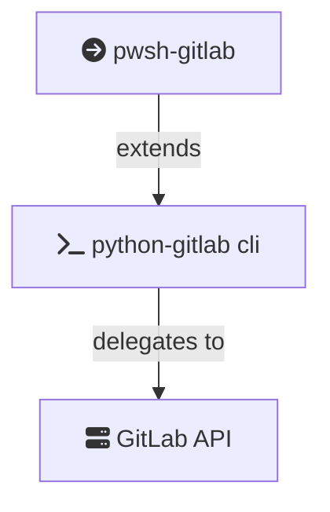

# Overview

This is a workaround for the fact that GitHub doesn't render mermaid in READMEs

```mermaid
graph TD
  pwsh-gitlab["fa:fa-arrow-circle-right pwsh-gitlab"]
  python-gitlab["fa:fa-terminal python-gitlab cli"]
  gitlab-api["fa:fa-server GitLab API"]
  pwsh-gitlab -- extends --> python-gitlab
  python-gitlab -- delegates to --> gitlab-api
```
